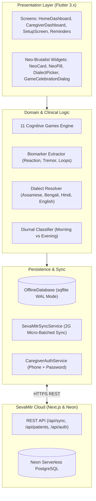

# Northeast Dementia Care (SevaMitr Mobile)

[](https://github.com/sainiks/northeast-dementia-care/releases/latest)
[](https://flutter.dev)
[](https://sqlite.org)
[](https://seva-mitr.vercel.app)

An accessible, offline-first digital healthcare companion tailored for elderly people living with dementia and their caregivers in the **North Eastern Region (NER) of India** and rural healthcare settings.

Equipped with **11 clinical cognitive assessment games**, a dialect-aware audio engine (Assamese, Bengali, Hindi, English), offline medication reminders, and resilient **2G/low-bandwidth cloud synchronization** with the **[SevaMitr Web Platform](https://seva-mitr.vercel.app)**.

---

## 📥 Download the Android App (APK)

Download the latest production release directly to your Android phone or tablet:

👉 **[Download Latest Release APK (v1.2.2)](https://github.com/sainiks/northeast-dementia-care/releases/latest)** (`56.2 MB`)

> **Note**: When installing for the first time, Android may prompt: *"Allow installation from unknown sources"*. Tap Settings and allow it for your browser or file manager.

---

## 📖 New User Guide: How to Sign Up, Connect & Sync

### 🧭 Where Should You Sign Up First?

> **Recommendation**: For family caregivers and ASHA healthcare workers, **sign up on the Website first (Path A)** to create your patient profile on a larger screen, then log in to the mobile app with the same phone number and password.

```mermaid
flowchart LR
    subgraph Web["1. Web Setup (Computer / Phone)"]
        W1["Sign up at seva-mitr.vercel.app<br/>(Phone + Password)"]
        W2["Register Patient Profile<br/>(Name, Age, District)"]
    end

    subgraph Mobile["2. Mobile App Linking"]
        M1["Install APK on Tablet/Phone"]
        M2["Open Caregiver Mode (PIN: 1234)"]
        M3["Sign in with same Phone Number"]
        M4["Cloud Patient Auto-Linked to SQLite!"]
    end

    subgraph Sync["3. Games & Live Dashboard"]
        S1["Patient plays 11 Cognitive Games"]
        S2["App extracts Reaction & Tremor Biomarkers"]
        S3["Background 2G Sync to SevaMitr Cloud"]
        S4["Live Web Radar & Circadian Charts!"]
    end

    Web --> Mobile --> Sync
```



---

### Path A (Recommended): Website First

#### Step 1: Create your Caregiver Account on the Web
1. Open your browser and go to **[https://seva-mitr.vercel.app/signup](https://seva-mitr.vercel.app/signup)**.
2. Enter your **Full Name**, **Phone Number** (e.g. `7428530125`) or Email, select your **Role** (*Family Caregiver* or *ASHA Worker*), and choose a secure **Password**.
3. Tap **Create Account** to enter your [Caregiver Dashboard](https://seva-mitr.vercel.app/caregiver).

#### Step 2: Register Your Patient Profile
1. On the web dashboard, click **`+ Register Patient`** (or go to [Patient Directory](https://seva-mitr.vercel.app/caregiver/patients)).
2. Fill in:
   - Patient Full Name (e.g., *Kunal Saini* or *Mridula Hazarika*)
   - Age, Gender & Region / District (e.g., *Kamrup Rural, Assam*)
   - Primary Language (Assamese, Bengali, Hindi, or English)
   - Dementia Stage (MCI, Mild, or Moderate)
3. Click **Register Patient**. A persistent patient profile is now live in the cloud registry.

#### Step 3: Install the App on Patient's Smartphone or Tablet
1. Download the latest **[`app-release.apk`](https://github.com/sainiks/northeast-dementia-care/releases/latest)**.
2. Install and launch the application.

#### Step 4: Link Your Caregiver Cloud Account in the Mobile App
1. On the app home screen, tap the gold **Caregiver Lock Icon** 🔒 in the upper-right corner.
2. Enter your Caregiver PIN (default is `1234`).
3. Scroll down to the **"Caregiver Cloud Account & Authentication"** card.
4. Tap **"Sign In with Phone / Email"**.
5. Enter the **exact same Phone Number** and **Password** you registered on the website.
6. Tap **"Log In & Sync"**.
7. ✨ **Automatic Patient Adoption**: The app connects to SevaMitr Cloud, retrieves your registered patient record, and links it directly to the local SQLite database!

#### Step 5: Play Games & Observe Live Cloud Telemetry
1. Return to the Home Screen and let the patient play any of the **11 Cognitive Games**.
2. When finished, the app computes **Dynamic Cognitive Index (DCI)**, **Reaction Latency (ms)**, **Tremor Jitter Score**, and **Confusion Loops**.
3. Whenever connected to Wi-Fi or mobile data (even slow 2G), the app automatically uploads game sessions in micro-batches of 10.
4. Open your [Web Caregiver Dashboard](https://seva-mitr.vercel.app/caregiver) — your patient's **Cognitive Radar Chart**, **Circadian Sundowning Timeline**, and **Activity Feed** update live!

---

### Path B: Mobile App First (Offline Rural Setup)

If you have no immediate web access in a remote village, you can set up everything from the phone:

1. **Install App & Set Up Patient**: Open the APK and complete the initial patient onboarding. The app works **100% offline**.
2. **Create Account or Sign In in App** (Unified with Website):
   - Tap the gold Lock 🔒 in the upper-right corner -> enter PIN `1234`.
   - Scroll down to the **"Caregiver Cloud Account & Authentication"** card and tap **"Sign In / Register with Phone & Password"**.
   - The unified Neo-Brutalist auth dialog opens with the exact same segmented pill switcher (`LOG IN` / `REGISTER`) found on the web:
     - **Full Name**: Your caregiver name (e.g., *Anuradha Baruah*).
     - **Caregiver Registration Banner**: Stethoscope medical banner explaining that patients cannot self-register directly and are managed by caregivers.
     - **Caregiver Designation Dropdown**: Select *Family Member / Primary Caregiver*, *ASHA / Anganwadi Community Health Worker*, or *Clinical Doctor / Medical Officer*.
     - **Phone / ID & Region**: Enter your 10-digit mobile number and district (e.g. `Kamrup Rural, Assam`).
     - **Password**: Enter a secure password (with visibility reveal toggle).
   - Tap **"CREATE ACCOUNT"** (or use the one-tap **"Use Hackathon Demo Account"** button).
3. **Automatic Cloud Patient Adoption**:
   - The app securely scopes the local SQLite patient to your newly created cloud account and initiates micro-batched 2G sync.
4. **Log in on the Website Anytime**:
   - Visit [https://seva-mitr.vercel.app](https://seva-mitr.vercel.app) on any PC, tablet, or mobile browser.
   - Enter your phone number and password. Your mobile patient metrics, radar charts, and circadian sundowning logs are already live!

---

### 📶 Understanding the Sync Status Icon

In the top header of the app:
- 🟢 **Cloud Done** (`Icons.cloud_done`): All game sessions are safely backed up to SevaMitr Cloud.
- 🟡 **Cloud Upload** (`Icons.cloud_upload`): Unsynced offline sessions are queued in local SQLite; they will upload as soon as connectivity resumes.
- 🔴 **Cloud Off** (`Icons.cloud_off`): Device is completely offline; data is safely preserved in local SQLite without data loss.

---

## 🎮 The 11 Clinical Cognitive Games

The mobile app includes all 6 web speed trials alongside the 5 original heritage games:

| # | Game Name | Clinical Domain | Biomarkers Extracted |
| :- | :--- | :--- | :--- |
| 1 | **Smriti Setu** | Visuospatial Memory | Recall accuracy, hesitation delay |
| 2 | **Doharani** | Executive Function | Sequence error count, working memory capacity |
| 3 | **Rang & Tanti** | Selective Attention | Stroop interference latency, inhibitory control |
| 4 | **Shabda Tarang** | Auditory Discrimination | Acoustic tone matching latency, repetition count |
| 5 | **Bazaar Saathi** | Calculation & Everyday Math | Currency budgeting hesitation, transaction errors |
| 6 | **Double Decision** | Useful Field of View (UFOV) | Central & peripheral visual processing speed (ms) |
| 7 | **Sound Sweeps** | Auditory Speed | Inter-Stimulus Interval (ISI threshold in ms) |
| 8 | **Target Tracker** | Divided Attention | Multi-Object Tracking (MOT) trajectory accuracy |
| 9 | **Speed Maze** | Visuomotor Processing | Navigational maze planning time & wall collisions |
| 10 | **Bijuli Tap** | Reaction & Motor Inhibition | Lightning Go/No-Go reaction time & commission errors |
| 11 | **Bikhama Khoj** | Visual Search | Feature-conjunction scanning latency & odd-one-out speed |

---

## 🏛️ System Architecture



---

## 🛠️ Developer Setup & Local Build

### Prerequisites
- Flutter SDK (>= 3.0.0 < 4.0.0)
- Android Studio / Android SDK (Platform 34+)
- Physical Android device or emulator

### Commands
```bash
# 1. Fetch dependencies
flutter pub get

# 2. Run static analysis
flutter analyze

# 3. Run unit, widget, and live sync tests
flutter test

# 4. Launch on connected device
flutter run

# 5. Build production release APK
flutter build apk --release
```
The compiled APK will be output to:
`build/app/outputs/flutter-apk/app-release.apk`

---

## 🔒 Privacy & Clinical Disclaimer

- **Privacy**: Patient data is stored locally in an encrypted SQLite database on the device. Sync to SevaMitr Cloud occurs strictly under authenticated Caregiver sessions.
- **Clinical Notice**: This application is a supportive cognitive tracking tool designed to assist family caregivers and certified healthcare providers. It is not an autonomous medical diagnostic device.

---

## 📄 License

All rights reserved by repository owners. Developed for accessible elderly healthcare in the North Eastern Region of India.
