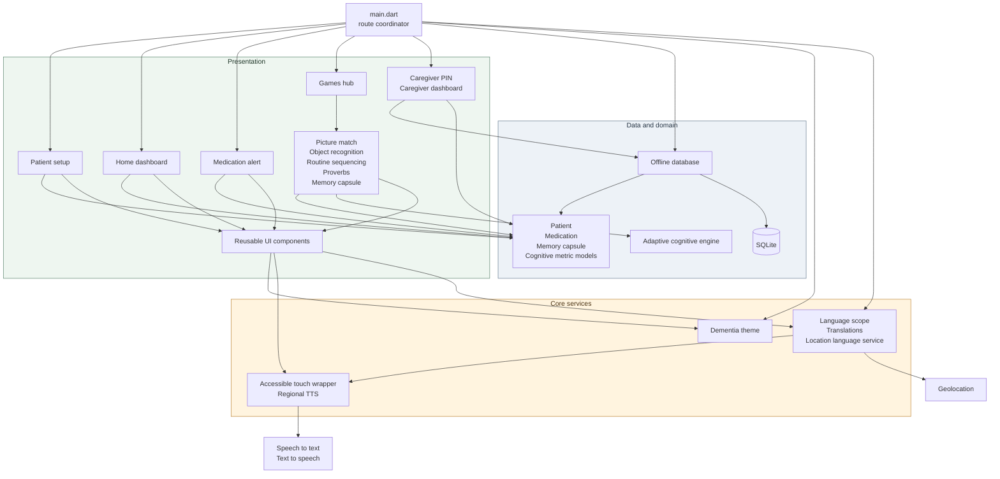

# Northeast Dementia Care

An accessible, offline-first Flutter companion for people living with dementia and the caregivers who support them in the North Eastern Region of India.

The app is designed around calm routines, large touch targets, local language support, and simple caregiver workflows. Core information remains available without an internet connection.

## Download the Android APK

Download the latest installable Android build from the [GitHub Releases page](https://github.com/sainiks/northeast-dementia-care/releases/latest).

> Android may ask you to allow installation from your browser or file manager. Only install APKs published from this repository.

## What the app includes

- Patient onboarding with a simple profile and language selection
- Medication reminders and alert screens
- Memory capsules for familiar people, places, and stories
- Cognitive activities including object recognition, routine sequencing, proverbs, and memory games
- Caregiver dashboard protected by a PIN
- Offline SQLite storage for patient data and memory capsules
- Text-to-speech, speech input, and accessible controls
- Location-aware language support for regional use

## Architecture



## Project structure

| Directory | Responsibility |
| --- | --- |
| `lib/core` | Accessibility, theme, localization, and regional language behavior |
| `lib/data` | SQLite database and typed application models |
| `lib/domain` | Adaptive cognitive logic and domain behavior |
| `lib/ui/components` | Reusable accessible controls and navigation |
| `lib/ui/screens` | Onboarding, home, caregiver, reminder, and game screens |
| `test` | Flutter tests, including localization coverage |

## Run locally

Prerequisites: Flutter 3.x and an Android device or emulator.

```bash
flutter pub get
flutter analyze
flutter test
flutter run
```

Build a release APK:

```bash
flutter build apk --release
```

The output is written to `build/app/outputs/flutter-apk/app-release.apk`.

## Privacy and safety

This is a supportive care tool, not a diagnostic or emergency medical service. It stores core data locally and should be used alongside professional medical guidance. Review the app behavior and permissions before deploying it to real patients.

## License

No license has been selected yet. Until a license is added, all rights are reserved by the repository owner.
